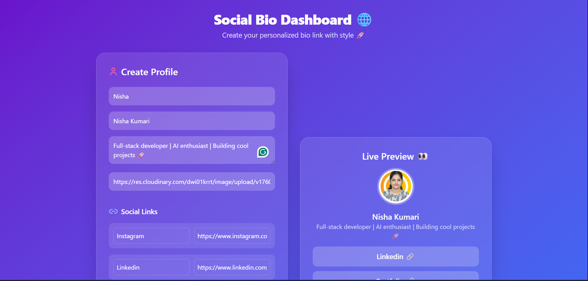
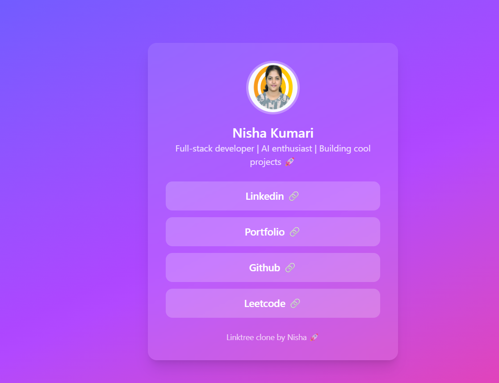

# 🌐 Social Bio Dashboard

A modern, **Linktree-style social bio dashboard** built with the **MERN stack**, featuring **live preview**, **glassmorphism UI**, **gradient design**, and **fully responsive layout**.

This project allows users to create a **personalized bio link page** with multiple social links, profile picture, and bio — **without authentication**. Perfect for portfolios, influencers, or personal branding.

---

## 🚀 Features

* **Create & Edit Profile**: Name, bio, profile picture, and multiple social links.
* **Live Preview**: Instantly see changes as you fill the form.
* **Modern UI**: Gradient background, glassmorphism cards, hover effects, and smooth transitions.
* **Responsive Design**: Works perfectly on desktop, tablet, and mobile.
* **No Authentication Required**: Easy to test and deploy.
* **Dynamic Routing**: Access profile pages via `/username`.

---

## 🛠️ Tech Stack

| Layer    | Technology                          |
| -------- | ----------------------------------- |
| Frontend | React.js, TailwindCSS, Lucide Icons |
| Backend  | Node.js, Express.js                 |
| Database | MongoDB                             |
| API      | RESTful APIs                        |

---

## 📂 Project Structure

```
social-bio-dashboard/
├── backend/
│   ├── server.js          # Express server
│   ├── config/db.js       # MongoDB connection
│   ├── models/userModel.js
│   ├── controllers/userController.js
│   └── routes/userRoutes.js
│
└── frontend/
    ├── src/
    │   ├── App.jsx
    │   ├── pages/
    │   │   ├── Home.jsx
    │   │   └── ProfilePage.jsx
    │   ├── utils/api.js
    │   └── index.css
    └── package.json
```

---

## ⚡ Installation

### 1️⃣ Clone the Repository

```bash
git clone <repository-url>
cd social-bio-dashboard
```

### 2️⃣ Backend Setup

```bash
cd backend
npm install
node server.js
```

Backend runs at `http://localhost:5000`

### 3️⃣ Frontend Setup

Open a new terminal:

```bash
cd client
npm install
npm run dev
```

Frontend runs at `http://localhost:3000`

---

## 🎨 How to Use

1. Open **[http://localhost:3000](http://localhost:3000)**
2. Fill out the **profile form**:

   * Username
   * Name
   * Bio
   * Profile picture URL
   * Social links
3. Click **Save Profile**
4. Visit your profile page via:

```
http://localhost:3000/<username>
```

Example: `http://localhost:3000/Nisha`


---

## 📸 Screenshots

### Home Page (Form & Live Preview)



### Profile Page



---

## 📌 Future Enhancements

* Add authentication (Google/Facebook/Email)
* Analytics: Link clicks & traffic
* Drag & Drop for link ordering
* Custom themes & templates
* QR code generation for profile

---

## 💡 Credits

* Developed by **Nisha Kumari**
* Icons: [Lucide Icons](https://lucide.dev)
* Images/Placeholder: [Flaticon](https://www.flaticon.com/)

---

## 📝 License

MIT License © 2025
